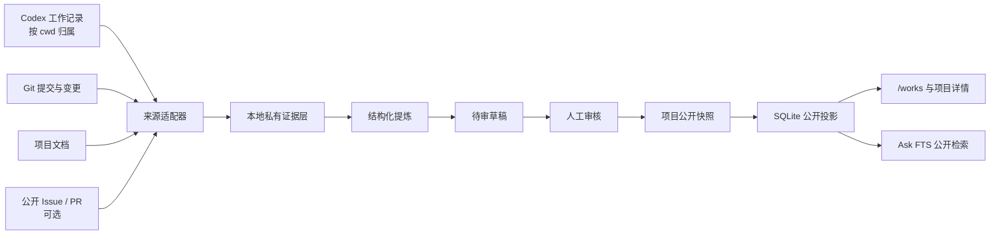

# 项目实践增量同步设计

> 状态：首版已实现并完成三个项目的真实发布验证；公开项目记录已接入“问一问”检索
> 范围：从多个本机项目增量归集项目能力、实验、决策、实践与里程碑，并在人工审核后发布到个人站。

## 1. 目标

这套能力把“项目”作为最小同步与发布边界。每个项目拥有自己的记录，个人站只做统一采集、审核、发布和阅读；新增一个使用既有来源类型的项目时，只增加配置，不编写项目专用同步程序。

成功标准：

- 同一同步命令可处理任意已登记项目，也能只处理一个项目。
- 没有来源变化时，不调用模型、不重写公开数据。
- 中途失败后可安全重跑，不重复条目、不跳过变化、不提前推进公开版本。
- 原始 Codex 会话、本机路径、凭据和未审核内容永远不进入公开读取面。
- 网站按项目展示能力、实验、决策、实践与证据，不出现脱离项目的全局实验池。

非目标：

- 不把每次 Agent 对话、每个 Commit 或每个任务都发布为内容。
- 不自动扫描并纳入本机所有仓库；项目必须显式登记。
- 首版不提供在线编辑后台；“问一问”只消费已批准的公开项目投影，不读取私有证据或待审草稿。
- 首版不做项目之间的自动知识图谱或自动合并实践。

## 2. 系统边界



通用能力位于个人站：项目登记、适配器协议、增量状态机、提炼、审核、快照生成、发布与校验。各业务项目无需依赖个人站代码，也不直接写公开 SQLite。

## 3. 项目登记

项目身份与本机位置分离：

- 提交到仓库的项目目录只保存可公开元数据、稳定 `projectId`、展示顺序、启用的来源类型和发布规则。
- 本机默认从个人站父目录解析允许列表中的目录；需要移动工作区时以 `PROJECT_WORKSPACE_ROOT` 覆盖，不把绝对路径写入配置或公开投影。
- 项目必须在允许列表中；嵌套仓库、临时 worktree 和扫描到的陌生目录不会被自动加入。

建议配置边界：

```text
config/project-catalog.mjs          # 可提交：公开身份、来源类型、展示策略
var/project-sync/<projectId>/       # 禁止提交：检查点、锁、运行摘要
data/sensitive/project-sync/        # 禁止提交：原始证据、草稿、审核材料
```

若多个 worktree 属于同一产品，它们共享同一个 `projectId`；分支和 worktree 是证据来源，不是新项目。一个项目改名或移动时也保持 `projectId` 不变。

## 4. 通用来源适配器

每种来源实现同一协议：读取自己的检查点、发现变化、输出标准证据单元，并给出只有在证据安全落盘后才能保存的下一个检查点。

```ts
type EvidenceUnit = {
  projectId: string;
  source: "codex" | "git" | "document" | "github";
  sourceKey: string;
  contentHash: string;
  occurredAt: string;
  observedAt: string;
  visibility: "private" | "public-source";
  payload: unknown;
};

type DeltaBatch = {
  evidence: EvidenceUnit[];
  removedSourceKeys: string[];
  nextCheckpoint: unknown;
};

interface ProjectSourceAdapter {
  discover(project: ProjectSource, checkpoint: unknown): Promise<DeltaBatch>;
}
```

### Codex 适配器

- 以标准化后的项目根目录匹配工作记录的 `cwd`，线程 ID 是稳定来源键。
- 不能只依赖创建时间：同一工作记录可能继续追加或被整理，因此保存线程 ID 与内容哈希，并对最近一段时间保留重叠扫描窗口。
- 提炼只读取任务结果、验证证据和明确决策；不把完整对话正文当作公开内容。

### Git 适配器

- 检查点是已采集提交，而不是“当前最新提交”。默认只读取已提交历史；脏工作区只能作为待审提示，不能证明能力已完成。
- 正常情况读取 `oldHead..newHead`；若历史改写导致旧检查点不再是祖先，先定位 merge-base 并生成受限重扫批次。
- Commit 是证据，不直接等于一个项目条目；多个 Commit 可以共同支持一项能力或一次实验。

### 文档适配器

- 只读取项目配置明确允许的 README、设计文档、ADR 和验证报告。
- 使用相对路径与内容哈希判断增量；重命名由哈希和显式别名辅助识别。
- 删除来源只生成撤回候选，不自动删除已经公开的结论。

### GitHub 适配器（第二阶段）

- 只读取显式配置的公开仓库、Issue 和 PR。
- 使用稳定 node ID、`updatedAt` 和分页游标；登录失败或分页不完整时不能推进检查点。

## 5. 项目记录模型

所有记录都有稳定 `recordId`、唯一主项目、内容修订哈希和至少一个私有证据引用。标题变化不会改变 `recordId`。

| 类型 | 回答的问题 | 典型状态 |
| --- | --- | --- |
| `capability` 项目能力 | 这个项目现在能完成什么？ | `experimental` / `active` / `retired` |
| `experiment` 实验记录 | 验证了什么，结果如何？ | `running` / `adopted` / `rejected` / `superseded` |
| `decision` 决策记录 | 在什么取舍中选择了什么？ | `accepted` / `superseded` |
| `practice` 实践记录 | 哪个方法可以在什么条件下重复？ | `active` / `conditional` / `retired` |
| `milestone` 里程碑 | 项目在何时发生了什么阶段变化？ | `reached` / `revised` |

公开记录结构：

```ts
type PublicProjectRecord = {
  id: string;
  kind: "capability" | "experiment" | "decision" | "practice" | "milestone";
  title: string;
  summary: string;
  bodyMarkdown?: string;
  status: string;
  occurredAt?: string;
  updatedAt: string;
  topics: string[];
  evidence: Array<{
    id: string;
    kind: "commit" | "issue" | "pull-request" | "document" | "runtime-check" | "private-verification";
    label: string;
    url?: string;
    verifiedAt?: string;
  }>;
  relatedRecordIds: string[];
};
```

公开证据只包含允许公开的 URL、标签与验证时间；私有来源可以支撑审核，但只以“本地验证”显示，不包含路径、会话正文或敏感值。

## 6. 增量状态机

一次项目同步严格按以下阶段运行：

```text
discover → ingest → derive → review → project → publish → verify
```

1. **Discover**：各适配器从自己的采集检查点发现新建、修改和撤回候选。
2. **Ingest**：按 `(projectId, source, sourceKey, contentHash)` 幂等写入本地私有证据层。
3. **Derive**：只处理新增证据或提炼器版本变化影响的记录；已有相同输入摘要时直接复用。
4. **Review**：新记录和内容修订默认进入待审；批准绑定具体修订哈希，内容变化会使原批准失效。
5. **Project**：从全部已批准记录生成规范化项目快照并计算 `revision = sha256(canonicalJson)`。
6. **Publish**：按 `projectId` upsert 一份公开快照；同一修订重复发布没有副作用。
7. **Verify**：重新读取公开行，核对 `projectId`、`revision`、记录数与摘要；全部一致后才更新公开修订。

### 双进度线

- **采集检查点**首版使用项目证据规范化 JSON 的 SHA-256 摘要。Git、允许文档和 Codex 项目记录全部安全落盘后才更新摘要；无变化时模型调用为零。未来接入分页远端来源时，适配器可在相同证据协议下增加自己的游标。
- **公开修订**只在 SQLite 写入和回读校验都成功后推进。网站始终读取最近一次成功公开修订。

提炼规则或输出 schema 升级时，通过 `sourceDigest + extractorVersion + schemaVersion` 判断需要重新提炼；不重新抓取没有变化的上游资料。

## 7. 审核与公开规则

- 默认全部是私有草稿；首版没有基于置信度的自动公开。
- 每个对外事实必须至少引用一条证据。运行成功、性能提升等运行时结论必须引用运行验证，不能只引用代码或 Agent 自述。
- 能力记录描述当前行为；计划、尝试和失败不能冒充当前能力。
- 实验失败、方案放弃和决定被替代可以公开，但必须保留当时的条件和结论。
- 来源变化只撤销受影响记录的批准；旧公开修订继续服务，直到新修订审核通过。
- 来源删除、项目归档和公开撤回都需要显式审核，不做级联自动删除。

审核界面首版可以是本地 CLI 生成的 Markdown diff，至少显示：新增、更新、建议撤回、证据引用、隐私扫描结果和公开快照差异。后续再决定是否需要站内管理界面。

## 8. 私有存储与本地 SQLite 公开投影

原始证据、模型输入、待审草稿、检查点和失败队列只保存在本机敏感目录。审核后的公开快照写入 `data/curation.sqlite`。

`project_snapshots` 表每个项目一行：

| 列 | 用途 |
| --- | --- |
| `project_id text primary key` | 不随仓库移动或改名变化的身份 |
| `slug text unique not null` | 公开路由 |
| `title / summary / status / period` | `/works` 列表无需读取 JSON 即可展示的字段 |
| `display_order integer` | 稳定策展顺序 |
| `source_observed_at timestamptz` | 本次公开内容覆盖到的最新证据时间 |
| `published_at timestamptz` | 当前公开修订发布时间 |
| `revision text not null` | 规范化快照摘要，用于幂等和回读校验 |
| `snapshot_json text not null` | 项目详情所需的已批准记录与公开证据 |

项目详情始终按项目整体读取，因此单行 JSON 快照能提供原子发布。Web 直读 SQLite；iOS/Android 经站点 `/api/works` 读取。公开快照同时派生为 `works` 范围的 Ask 文档，并与项目快照在同一 SQLite 事务中替换；FTS 索引不是内容真相来源。

安全边界：

- SQLite 随部署只读，运行时与浏览器没有写入口。
- 发布脚本只在本机读取敏感来源并原子 upsert 单行快照。
- iOS/Android 只读取站点公开 API，不接触本地文件路径。

## 9. 命令与模块边界

建议命令：

```bash
pnpm projects:sync -- --project pi-samples --dry-run
pnpm projects:sync -- --project pi-samples
pnpm projects:sync -- --project pi-samples --approve
pnpm projects:sync -- --project pi-samples --approve --publish
pnpm projects:sync:pi -- --project pi-samples
pnpm projects:publish
```

- `sync` 负责发现、采集与提炼；没有显式批准时不会发布。
- `--approve` 将当前草稿与项目审校覆盖绑定为已批准修订；`--publish` 只读取批准后的记录，生成、发布并回读校验项目快照。
- 不传 `--project` 时默认处理全部已登记项目，并保持项目级串行，避免同时占用多个 Agent/模型会话。
- 项目同步与其他离线分析管道统一默认使用 Codex CLI；只有显式传 `--engine pi` 或使用 `projects:sync:pi` 时才改用 Pi / Kimi。
- `--dry-run` 只报告项目数、证据变化数、待提炼数、待审数和将发布的记录数，不写状态、不调用模型、不输出敏感正文。

建议模块：

```text
modules/project-sync/
├─ schema.mjs
├─ source.mjs
├─ derive.mjs
└─ publish.mjs
```

首版把本地 Git、文档和 Codex 采集收在 `source.mjs`，因为它们共享文件系统边界且只有一个消费者；项目差异只存在于 `project-catalog.mjs`，禁止出现 `if (projectId === "pi-samples")` 一类项目特判。来源协议出现第二个独立消费者或远端分页来源后再拆适配器文件。

## 10. 失败与恢复语义

| 场景 | 行为 |
| --- | --- |
| 某个必需适配器失败 | 不推进该适配器检查点；本项目不生成新公开修订 |
| 可选适配器失败 | 运行标记为 `partial`；只有配置允许时才可基于其余完整证据继续审核 |
| 私有证据已保存、提炼失败 | 采集检查点保留；失败项进入补偿队列，下次不重新访问来源 |
| 等待审核 | 可继续采集后续变化；网站继续服务旧公开修订 |
| SQLite 写入或回读失败 | 不推进公开修订；同一快照可幂等重发 |
| 来源被删除 | 生成撤回候选；未批准前不删除公开记录 |
| Git 历史改写 | 从 merge-base 受限重扫；无法证明完整时停止推进检查点 |
| 进程并发启动 | 项目级锁拒绝第二个写入者；不同项目也默认串行 |
| 提炼器版本升级 | 只重跑派生层，不重新抓取无变化来源 |

每次运行输出结构化摘要：`discovered / ingested / reused / derived / failed / pending_review / approved / published / withdrawn`。任何阶段存在未确认失败时，整体结果保持 `partial` 或 `failed`，不能只因脚本进程结束就报告成功。

## 11. 页面映射

### `/works`

只显示项目档案，不建立独立的全局实验入口。每个卷宗展示项目定位、状态、当前验证问题、最近两到三条项目记录、真实样张和“进入项目档案”链接。

### `/works/[slug]`

沿用身份轨和连续文章流，项目内使用轻量文字索引定位：

```text
概览 · 当前能力 · 正在验证 · 实验记录 · 关键决策 · 沉淀实践 · 证据
```

- 顶部显示 `资料截至`（`sourceObservedAt`）和 `公开更新`（`publishedAt`），两者语义分开。
- 实验使用左侧日期/状态、右侧问题/结果的登记簿行；不做卡片、彩色状态徽章或时间轴圆点。
- 能力、决策和实践均可链接到稳定锚点；证据链接跟随所属记录，不单独堆成资料仓库。
- 项目记录过多时才增加项目内分页或子路由；首版保持一个项目详情页，避免空层级。

## 12. 首轮落地顺序

1. 已用合成夹具实现内容摘要、项目归属、敏感内容闸门与公开修订幂等测试。
2. 已用 `personal-sites` 自举并发布 17 条能力、实验、决策、实践与里程碑记录。
3. 已用 `pi-samples` 验证跨仓库接入并发布 17 条记录。
4. 已用 `waker` 验证长周期项目证据并发布 18 条记录。
5. 已把项目概览与每条公开记录派生为 `works` Ask 文档，并在全量历史数据上重建 FTS 索引。
6. 后续再接定时自动化和 GitHub Issue/PR 适配器；这些不阻塞当前项目档案闭环。

首轮每个项目至少人工确认：项目概览、三项当前能力、三条实验或决策、一条明确失败/撤回记录，以及每条公开结论的证据可追溯性。

## 13. 验收标准

- 同一项目连续运行两次且来源未变：第二次 `derived = 0`、`published = 0`。
- 在任意阶段强制中断后重跑：没有重复证据或记录，最终快照修订与无中断运行一致。
- 必需来源分页或读取失败：对应检查点不前移，公开快照不变化。
- 修改提炼器版本：只重建受影响草稿，不重新抓取 Git/Codex/文档证据。
- 未批准记录、原始会话、本机绝对路径、凭据模式和敏感正文无法从公开 SQLite 或生产页面读取。
- `/works/[slug]` 只渲染该项目记录；跨项目关联必须显式链接，不能复制所有权。
- 发布成功必须以 SQLite 回读的 `revision` 与记录数一致为准，不能只以命令退出码判断。
- 项目接入使用配置与适配器组合完成，不新增项目专用分支逻辑。
